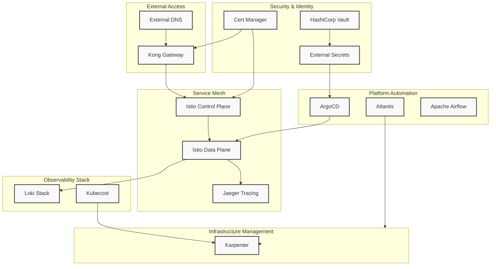
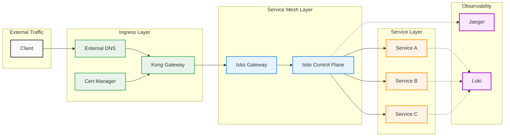
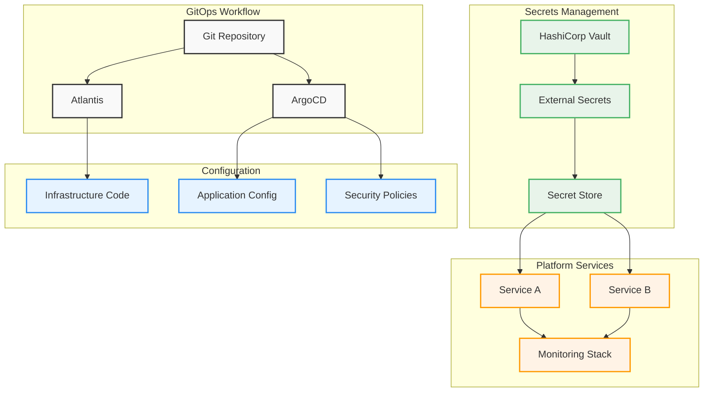
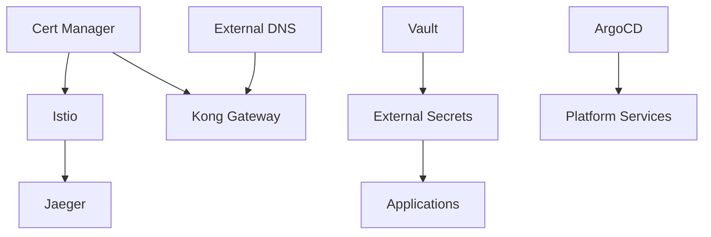

# Kubernetes Platform Terraform Modules

🛡️ **Security-Hardened** collection of Terraform modules for deploying and managing a comprehensive Kubernetes platform with essential services and tools.

> **Latest Update**: Enhanced with production-ready security controls, encryption, and compliance-ready configurations.

## 🚀 Platform Components

### Core Infrastructure
- **[Karpenter](./k8s-platform-karpenter)**: Kubernetes Node Autoscaling
- **[External DNS](./k8s-platform-external-dns)**: DNS Records Management
- **[Cert Manager](./k8s-platform-cert-manager)**: Certificate Management
- **[External Secrets](./k8s-platform-external-secrets)**: Secrets Management

### Service Mesh & Networking
- **[Istio](./k8s-platform-istio)**: Service Mesh
- **[Kong Gateway](./k8s-platform-kong-gw)**: API Gateway
- **[Jaeger](./k8s-platform-jaeger)**: Distributed Tracing

### Observability & Monitoring
- **[Loki Stack](./k8s-platform-loki-stack)**: Log Aggregation
- **[Kubecost](./k8s-platform-kubecost)**: Cost Management
- **[ArgoCD](./k8s-platform-argocd)**: GitOps & Deployment Management

### Platform Tools
- **[Airflow](./k8s-platform-airflow)**: Workflow Management
- **[Atlantis](./k8s-platform-atlantis)**: Terraform Automation
- **[Vault](./k8s-platform-vault)**: Secrets Management

## 📋 Prerequisites

- Terraform >= 1.5.0
- Kubernetes cluster (tested with EKS) with IRSA enabled
- kubectl configured to access your cluster
- Helm 3.x
- AWS CLI configured (if using AWS services)
- **Security Requirements**:
  - EKS cluster with Pod Security Standards enabled
  - AWS Secrets Manager or Systems Manager Parameter Store
  - Network policies support (e.g., Calico, Cilium)
  - KMS keys for encryption (recommended)

## 🏗️ Architecture

### Platform Components


This diagram shows the high-level architecture of the platform, including:
- External access layer (Kong, External DNS)
- Security components (Cert Manager, Vault)
- Service mesh (Istio, Jaeger)
- Observability stack (Loki, Kubecost)
- Automation tools (ArgoCD, Atlantis, Airflow)
- Infrastructure management (Karpenter)

### Network Flow


This diagram illustrates:
- External traffic flow
- Ingress configuration
- Service mesh routing
- Observability integration

### Configuration Management

This diagram shows:
- GitOps workflows
- Secrets management
- Configuration distribution
- Service integration

## 🛠️ Module Structure

Each module follows a consistent structure:

```
k8s-platform-<component>/
├── README.md           # Module documentation
├── main.tf            # Main Terraform configuration
├── variables.tf       # Input variables
├── outputs.tf         # Output values
├── versions.tf        # Provider & version constraints
├── examples/          # Example implementations
│   └── main.tf
└── templates/         # Helm values templates
    └── values.yaml
```

## 🚀 Quick Start

### 1. Clone and Validate
```bash
git clone https://github.com/cloudon-one/k8s-platform-modules.git
cd k8s-platform-modules

# Run security validation
./security-validation.sh
```

### 2. Security-First Configuration
```hcl
# Example: Secure Kubecost deployment with IRSA
module "kubecost" {
  source = "./k8s-platform-kubecost"
  
  cluster_name = "my-eks-cluster"
  create_iam_resources = true  # Use IRSA instead of hardcoded keys
  s3_bucket_name = "my-kubecost-bucket"
  
  # Security settings
  enable_network_policies = true
}

# Example: ArgoCD with enhanced security
module "argocd" {
  source = "./k8s-platform-argocd"
  
  environment = "production"
  argocd_s3_bucket = "my-argocd-manifests"  # Specific bucket, not wildcard
  enable_network_policies = true
}
```

### 3. Security Checklist
☑️ Use IRSA for AWS access (set `create_iam_resources = true`)
☑️ Specify exact S3 bucket names (avoid wildcards)
☑️ Enable network policies where available
☑️ Configure AWS Secrets Manager/Parameter Store
☑️ Review IAM policies for least privilege

## 📦 Available Modules

### Core Infrastructure

#### Karpenter
```hcl
module "karpenter" {
  source = "./k8s-platform-karpenter"
  cluster_name = "my-cluster"
}
```

#### External DNS
```hcl
module "external_dns" {
  source = "./k8s-platform-external-dns"
  domain = "example.com"
}
```

### Service Mesh & Networking

#### Istio
```hcl
module "istio" {
  source = "./k8s-platform-istio"
  enable_monitoring = true
}
```

#### Kong Gateway
```hcl
module "kong" {
  source = "./k8s-platform-kong-gw"
  enable_proxy_protocol = true
}
```

### Observability & Monitoring

#### Loki Stack
```hcl
module "loki" {
  source = "./k8s-platform-loki-stack"
  retention_days = 30
}
```

## 🔧 Configuration

Each module has its own configuration options. Please refer to the individual module's README.md for detailed configuration options.

## 🔍 Module Dependencies



## 🛡️ Security Features

### **Production-Ready Security Controls**
- **Zero Hardcoded Secrets**: IRSA (IAM Roles for Service Accounts) integration
- **Least Privilege IAM**: Specific permissions instead of wildcards
- **Pod Security**: Non-root containers, dropped capabilities, read-only filesystems
- **Encryption Everywhere**: Data at rest and in transit encryption
- **Network Isolation**: Network policies and security group restrictions
- **Compliance Ready**: SOC 2, PCI DSS, GDPR, NIST baseline controls

### **Security Validation**
```bash
# Run comprehensive security checks
./security-validation.sh
```

### **Key Security Improvements**
- ✅ **No Credential Exposure**: Eliminated hardcoded AWS keys
- ✅ **Restricted Permissions**: Replaced `*` permissions with specific actions
- ✅ **Container Security**: Added security contexts to all pods
- ✅ **Data Protection**: RDS, Redis, and S3 encryption enabled
- ✅ **Network Security**: Granular egress rules and network policies

## 📊 Monitoring & Observability

- Prometheus metrics exposed
- Grafana dashboards included
- Tracing with Jaeger
- Logging with Loki
- Cost monitoring with Kubecost

## 🤝 Contributing

1. Fork the repository
2. Create your feature branch
3. Commit your changes
4. Create a pull request

## 🔒 Advanced Security

### **Secrets Management**
- External Secrets Operator integration with AWS Secrets Manager
- HashiCorp Vault for advanced secret workflows
- No secrets stored in Terraform state or container images
- Automatic secret rotation support

### **Network Security**
- **Default-deny network policies** for critical namespaces
- **Service mesh security** with Istio mTLS
- **API Gateway protection** with Kong rate limiting and authentication
- **Granular egress controls** (HTTPS, HTTP, DNS only)

### **Data Protection**
- **Database encryption**: RDS with encryption at rest
- **Cache security**: Redis with auth tokens and encryption
- **Storage security**: S3 with server-side encryption and public access blocking
- **Backup encryption**: Automated encrypted backups with retention policies

### **Compliance & Auditing**
- **Pod Security Standards**: Restricted profile enforcement
- **Security contexts**: Non-root, read-only, capability dropping
- **Resource monitoring**: Prometheus metrics for security events
- **Audit logging**: CloudTrail integration for all AWS API calls

## Maintenance

### Regular Tasks

- Update component versions
- Review resource utilization
- Monitor costs with Kubecost
- Backup critical configurations

### Version Updates

Update component versions in respective `terragrunt.hcl` files:
```hcl
inputs = {
  chart_version = "x.y.z"
}
```

## 🆘 Security & Support

### 🛡️ **Security Reporting**
For security vulnerabilities:
1. **DO NOT** create public issues for security vulnerabilities
2. Email security concerns privately to the maintainers
3. Include detailed reproduction steps and impact assessment
4. Allow reasonable time for fixes before public disclosure

### 📞 **General Support**
For general issues and support:
1. Run `./security-validation.sh` first to check for common issues
2. Check existing issues in the repository
3. Review the `SECURITY-IMPROVEMENTS.md` for recent changes
4. Create a new issue with:
   - Environment details (Kubernetes version, modules used)
   - Security validation script output
   - Error messages and logs
   - Steps to reproduce

### 📚 **Documentation**
- **Security Guide**: `SECURITY-IMPROVEMENTS.md`
- **Individual Modules**: Each module's `README.md`
- **Best Practices**: This README's Best Practices section
- **Troubleshooting**: Run security validation for automated checks

## License

This project is licensed under the MIT License - see the [LICENSE](LICENSE) file for details.

---

## 🚨 **Security Notice**

This repository has been **security-hardened** and is production-ready. Before deployment:

1. **Run Security Validation**: `./security-validation.sh`
2. **Review Security Improvements**: Read `SECURITY-IMPROVEMENTS.md`  
3. **Configure Secrets Management**: Set up AWS Secrets Manager/Parameter Store
4. **Enable IRSA**: Use IAM Roles for Service Accounts instead of hardcoded credentials
5. **Apply Network Policies**: Enable network microsegmentation

### 🏆 **Security Compliance Status**
- ✅ **No Hardcoded Secrets**: All credential exposure eliminated
- ✅ **Least Privilege IAM**: Wildcard permissions replaced with specific actions
- ✅ **Pod Security**: Non-root containers with dropped capabilities  
- ✅ **Data Encryption**: At-rest and in-transit encryption enabled
- ✅ **Network Isolation**: Security groups and network policies configured
- ✅ **Audit Ready**: CloudTrail and security monitoring configured

**Ready for:** SOC 2, PCI DSS, GDPR, and NIST compliance frameworks.

---

*"Security is not a feature, it's a foundation."* 🛡️


## 🆕 What's New: Security Enhancements

### 🚨 **Critical Security Fixes Applied**
- **Eliminated Hardcoded Credentials**: Removed AWS access keys from all templates
- **Restricted IAM Permissions**: Replaced wildcard (`*`) with specific permissions
- **Enhanced Pod Security**: Added security contexts to prevent privilege escalation
- **Improved Network Security**: Granular egress rules and network policies
- **Full Encryption**: Data at rest and in transit across all components

### 🛠️ **New Security Tools**
```bash
# Automated security validation
./security-validation.sh

# Check security improvements
ls -la SECURITY-IMPROVEMENTS.md
```

### 🌟 **Production-Ready Features**
- IRSA (IAM Roles for Service Accounts) support
- Pod Security Standards enforcement
- Network policy templates
- Encrypted databases and caches
- Security validation automation

---

## ✨ Best Practices

1. **Security-First Approach**
   - Always use IRSA instead of hardcoded credentials
   - Enable Pod Security Standards in all namespaces
   - Implement network policies for microsegmentation
   - Use External Secrets Operator for secret management
   - Regular security validation with automated tools

2. **Infrastructure as Code**
   - Use GitOps workflows with ArgoCD
   - Implement proper Terraform state management
   - Version your infrastructure code with semantic versioning
   - Apply infrastructure changes through pull requests

3. **Monitoring & Observability**
   - Set up comprehensive alerting with Prometheus
   - Implement centralized logging with Loki
   - Enable distributed tracing with Jaeger
   - Monitor costs and resource usage with Kubecost

4. **Operational Excellence**
   - Use node autoscaling with Karpenter
   - Implement horizontal pod autoscaling
   - Configure proper resource requests and limits
   - Regular backup and disaster recovery testing


## 🔄 Version Compatibility Matrix

| Module | Kubernetes Version | Terraform Version | Provider Version |
|--------|-------------------|-------------------|------------------|
| ArgoCD | >=1.24 | >=1.0.0 | >=2.0.0 |
| Istio | >=1.24 | >=1.0.0 | >=2.0.0 |
| Cert Manager | >=1.24 | >=1.0.0 | >=2.0.0 |
| Kong Gateway | >=1.24 | >=1.0.0 | >=2.0.0 |
| External DNS | >=1.24 | >=1.0.0 | >=2.0.0 |
| Vault | >=1.24 | >=1.0.0 | >=2.0.0 |

## 🔄 Upgrade Guide

Please refer to individual module READMEs for specific upgrade instructions.
